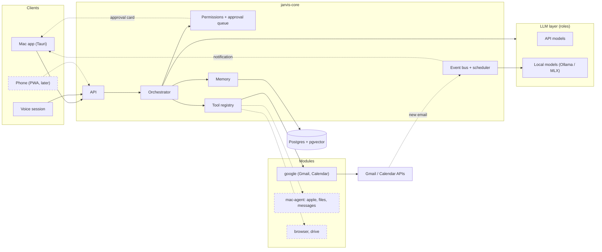

# Architecture

Jarvis is one background service on the Mac that exposes an API. The Mac app, and later the phone,
are only its clients. Goals and decisions are in [design](design.md).

## Components

Dashed lines and boxes are components of later phases.



## Request flows

- **Chat request:** app → API → orchestrator. It loads memory, reads freely, and every action it
  proposes goes into the approval queue.
- **Voice conversation:** the voice session runs the conversation, and every request that needs data
  or an action goes to the orchestrator through the API, like every other client. So there is one
  brain. Where the session runs is [open](#open-questions).
- **External event:** a new email or a scheduled task → event bus → classification by a local model.
  Only what passes a notification rule reaches me.
- **Approval:** I approve in the app, and only then does the module run the tool.

Details: [orchestrator](systems/orchestrator.md), [voice](systems/voice.md),
[events](systems/events.md), [permissions](systems/permissions.md).

## Processes

- **`jarvis-core`:** a Python service with the API, the orchestrator, the event bus and the
  scheduler. It runs through `launchd` and starts at login.
- **`mac-agent`:** a separate process holding the Mac-dependent tools (Apple, messages, files). When
  the core moves to the cloud, it stays on the Mac and connects to it.
- **Postgres with pgvector** ([storage](systems/infra.md#storage)).
- **Local models:** Ollama or MLX, native ([LLM](systems/llm.md)).
- **The app:** Tauri, with a global keyboard shortcut ([app](systems/app.md)).

## Extension points

Every addition comes in through one of these, and the core doesn't change. If an addition needs a
core change, an extension point is missing.

| What is added | How | What changes |
|---|---|---|
| Device (phone, watch) | A new client talking to the same API | Client code only |
| Connector (messages, browser, files) | A module folder: `module.yaml` with tools, prompts, triggers and memory space | A new folder |
| Tool | A function with a decorator in the tool registry, or an external MCP server | A tool file or a config line |
| Model or provider, local or API | An implementation of the provider interface, and a role → model mapping | Config |
| Voice model | An implementation of the voice provider interface | Config |
| Google account | Another OAuth, one row in the `accounts` table | Data only |
| Notification rule | A line in the rules file: event, condition, channel | Config |
| Scheduled task | A cron definition in the module | Config |
| Move to the cloud or an always-on machine | The same Docker Compose on another machine; the Mac tools stay as a small agent on the Mac | Deployment only |

## Iron rules

- The core doesn't know names of clients, modules or providers. It knows only interfaces.
- Every tool declares its permission level: read or action. The permission layer enforces it, not the tool.
- Every setting that can change without code lives in config, with defaults.
- Every table includes `user_id`, and every external tool takes an `account_id`.
- Mac-dependent tools (Apple, messages, files) are kept apart from the rest, so the core can move to
  the cloud without rewriting them.

## Repo layout

Python packages live under `src/jarvis/` (src layout, ADR-0001); the rest stay at the root.

```
src/jarvis/
  core/        API, orchestrator, approvals, memory, events
  llm/         providers, role mapping, voice providers
  modules/     google/ in the MVP; apple/, files/, messages/, browser/ later
  mac_agent/   Mac-dependent tools
app/           Tauri and the TypeScript UI
config/        YAML files
evals/         eval cases, the source of truth (see systems/evals.md)
docs/          design overview, architecture, systems/, modules/, plan/, adr/
spikes/        one-off experiments, not product code
infra/         launchd, docker-compose, CI
tests/
```

Spike code backs the numbers in its ADR, which is why `spikes/` lives in the repo.

## Open questions

- **Where the voice session runs** (Phase 6): in the Tauri client or in `jarvis-core`. Until it is
  decided, voice goes through the API like every other client ([voice](systems/voice.md)).
  Echo cancellation is an input to this decision. The options are browser AEC in the Tauri
  webview or macOS Voice Processing I/O in Python; neither is tested yet
  ([voice open questions](systems/voice.md#open-questions)).
